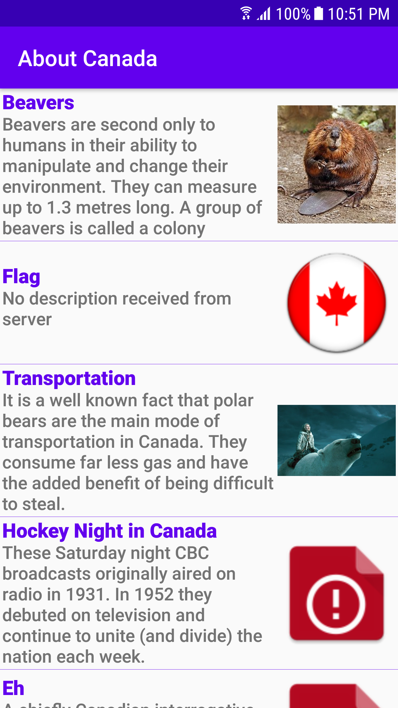
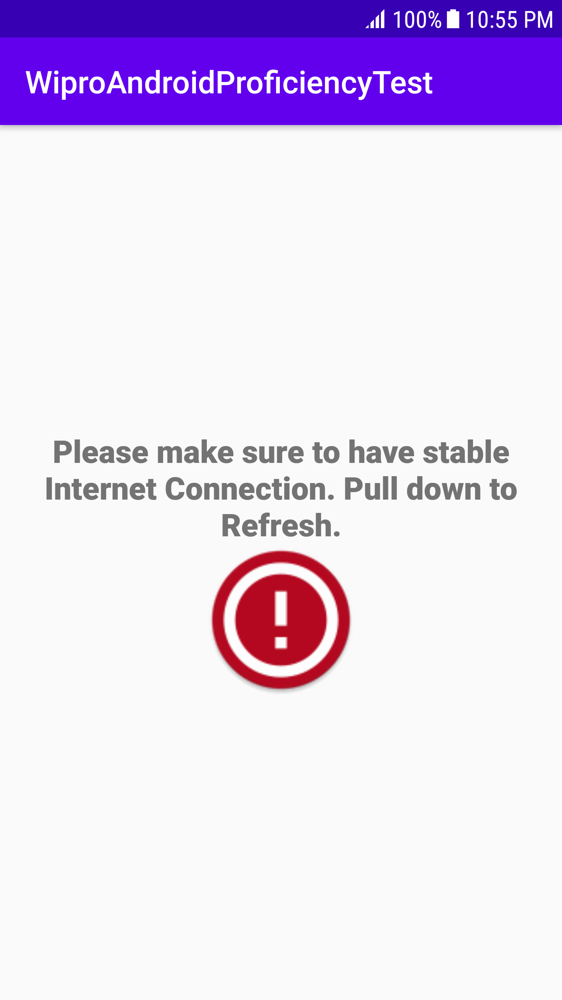

# Facts - DynamicallySizedListViewItems
This project consumes a REST service and displays photos with headings and descriptions. This was developed to assess candidate developer’s Android technical proficiency, coding knowledge and
style.

## Detailed Specification

1. This Android App ingests a json feed from https://dl.dropboxusercontent.com/s/2iodh4vg0eortkl/facts. The feed contains a title and a list of rows.
2. Displays the content (including image, title and description) in a List.
 The title in the ActionBar is updated from the json data.
 Each row is dynamically sized to display its content. This means some rows will be larger than others.
3. Has Pull To Refresh functionality allowing the data & view to be updated


## Getting Started

```
git clone https://github.com/NamrataBagerwal/Facts-DynamicallySizedListViewItems.git
```

Or the same can be imported directly in Android Studio via VCS -> Git -> Clone.

## Built With
1. Android Studio 3.6.2
1. Android Kotlin 1.3.61
2. Glide to Lazy Load Images
3. Retrofit for Networking Calls
4. Koin for Dependency Injection
5. Kotlin Coroutines for Thread Management
6. Variety of Test Libraries: Mockito, JUnit, Espresso, Robolectric, Koin-Test and their respective Kotlin extensions

## Prerequisites
Device with Android version 7.1 (v25), Android Studio 3.6.2, Android Kotlin 1.3.61

## Installing
Wait for the project to get build successfully then run the app module on device/emulator. 
Recyclerview with LiveData from ViewModel will be loaded capable of handling screen rotation.
Also try Pull To Refresh feature

Each row of the table should look roughly like the following image:


Error View loaded in case of Internet Off Connection/Server Unavailability:


Video:


## Running the tests

Android UI Instrumentation Test Cases for Activity are written that checks the state of the UI being loaded based on Internet Connection and Server Availability.

Select and run FactsActivityInternetOnInstrumentationTest with Internet Connection On. List will be loaded as expected.
Select and run FactsActivityInternetOffInstrumentationTest with Internet Connection Off. Error View will be loaded.

Local Unit test cases for Activity are up and running.
## Known Issues

Images(Image Link) coming from the json feed link url(https://dl.dropboxusercontent.com/s/2iodh4vg0eortkl/facts) stated above has white extra background which gives extra-erraneous space in each row.

## Future Enhancements

Code Optimization and adding Comments


## Authors
Namrata Bagerwal

## License
This project is open source and is purely developed as part of Coding Exercise.
